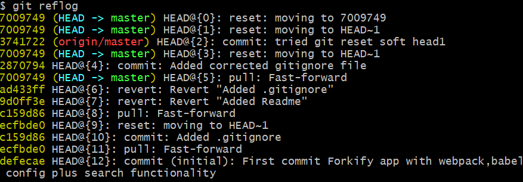

# Инструкция по работе с командами Git.

Сначала надо создать репозитарий, за которым будет следить Git. Вы создаете папку в корневом каталоге, а в ней файл с расширением .md 

**Очень важно назвать его без пробелов!!!.**

# Основные команды.
* git init  - создается репозитарий.
* git add название файла - даете команду на отслеживание программой всех изменений в вашем файле md.
* git commit -m "название изменений" - метка для Вас. Это как точка сохранения.
* __git commit -am__ "" - заменят две последних команды. Создает коммитс(запись) для всех изменений. 
* git diff - покажет разницу после сохранения коммита.
* git reflog - покажет журнал коммитов и их изменений.

* git checkout  - переход между коммитами.
# Выделение текста

Стобы выделить текст курсивом надо обрамить его (*) или знаком нижнего подчеркивания.
Например *вот так* или _так_.

Полужирным (**) или (__ __). **ВОТ ТАК** или __ВОТ ТАК__

Альтернативные способы нужны для совмещения. _Например  - мне пора **обедать**._

## Работа с изображениями

Чтобы вставить изображение в текст, достаточно написать следующее:

## Косяки лектора

